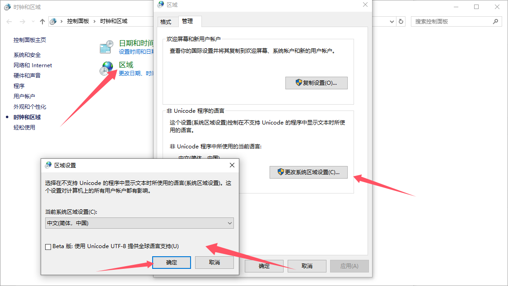

### timeline

#### 2025.6.30-2025.7.1

使用vcpkg, 安装了在windows和麒麟上的osg-qt环境。

vcpkg.json:

```json
{
    "name": "osg-drawing",
    "version-string": "0.1.0",
    "description": "An OpenSceneGraph-based drawing app supporting customizable points, lines, surfaces and solids.",
    "dependencies": [
      "osg-qt",
      "glm"
    ]
  }
```

因为没有版本要求

安装了

osg 3.6.5#27

qt 5.15.16#5

##### 安装遇到的问题

安装过程中，遇到很多错误：

1. 网络问题，vcpkg的cmake使用https下载github上的.tar.gz。没有镜像，不能使用ssh, 所以很慢。

   或者是一下网站都进不去，要找镜像下好后传到downloads。

   比如

   ```cpp
   scp libspatialite-5.1.0.tar.gz liushisheng@192.168.80.128:/home/liushisheng/vcpkg/downloads/
   ```

   

2. 权限问题，要给vcpkg下载的安装脚本的可运行权限

   比如

   ```cpp
   chmod -R +x ./vcpkg/
   ```

   

3. 还有就是缺少库，vcpkg打印出的信息或者给出的日志文件中有描述。

   直接给AI, 给可能的库, 一口气装好（实际好几口气）

   ```cpp
   sudo apt install autoconf automake libtool pkg-config gettext
   ```

   

#### 2025.7.2

##### 乱码问题

首先, 想偷懒，用cursor写好框架，首先遇到的问题就是字符集问题。(因为要切换两个IDE)

因为cursor基于 VSCode 的开源代码进行二次开发，都默认使用UTF-8的格式打开文件并保存（保存后，再用原编码打开也已经乱码修改不回来了）。而windows使用的新建文件默认使用GBK。

换个编码保存本来也没问题，但是VS编译器默认使用系统的**本地代码页（如 GBK、936）**编译源文件，然后就是使字符串常量乱码。导致编译不通过等。


然后之前的方法：设置系统使用UTF-8, 会导致一些古老的软件乱码。

（比如飞秋。现在还有一部分乱码估计要重装）



所以可以使用

```cpp
#pragma execution_character_set("utf-8")
```

告诉 VS 编译器按 UTF-8 方式解析源码中的字符串常量

但要看编译器

可以使用 UTF-8 源文件 + `fromUtf8()`

比如qt：

```cpp
QString str = QString::fromUtf8("你好");
```

##### 可以使用脚本自动递归切换字符集

比如

```shell
python charset_converter.py ./project --target-encoding utf-8 --extensions .h,.cpp
```

```py
#!/usr/bin/env python3
# -*- coding: utf-8 -*-
"""
字符集转换脚本
递归转换 .h, .cpp, .hpp, .c, .cc, .cxx 文件的字符集格式
支持自动检测源编码
依赖:
pip install chardet
"""

import os
import sys
import argparse
import chardet
from pathlib import Path

class CharsetConverter:
    def __init__(self, source_encoding=None, target_encoding='gbk', extensions=None):
        self.source_encoding = source_encoding
        self.target_encoding = target_encoding
        if extensions:
            self.supported_extensions = set(extensions)
        else:
            self.supported_extensions = {'.h', '.cpp', '.hpp', '.c', '.cc', '.cxx'}

    def detect_encoding(self, file_path):
        try:
            with open(file_path, 'rb') as f:
                raw_data = f.read()
                result = chardet.detect(raw_data)
                return result['encoding']
        except Exception:
            print(f"检测文件 {file_path} 编码时出错")
            return None

    def convert_file(self, file_path):
        try:
            source_enc = self.source_encoding or self.detect_encoding(file_path)
            if not source_enc:
                print(f"无法检测文件 {file_path} 的编码")
                return False
            with open(file_path, 'r', encoding=source_enc, errors='ignore') as f:
                content = f.read()
            content_bytes = content.encode(self.target_encoding, errors='ignore')
            with open(file_path, 'wb') as f:
                f.write(content_bytes)
            print(f"转换成功: {file_path} ({source_enc} -> {self.target_encoding})")
            return True
        except Exception as e:
            print(f"转换文件 {file_path} 时出错: {e}")
            return False

    def convert_directory(self, directory_path):
        directory = Path(directory_path)
        if not directory.exists():
            print(f"目录不存在: {directory_path}")
            return 0, 0
        success_count = 0
        total_count = 0
        for file_path in directory.rglob('*'):
            if file_path.is_file() and file_path.suffix.lower() in self.supported_extensions:
                total_count += 1
                if self.convert_file(file_path):
                    success_count += 1
        return success_count, total_count

def main():
    parser = argparse.ArgumentParser(description='递归转换C++源文件的字符集格式（简化版）')
    parser.add_argument('path', help='要转换的文件或目录路径')
    parser.add_argument('--source-encoding', '-s', help='源编码 (如不指定则自动检测)')
    parser.add_argument('--target-encoding', '-t', default='gbk', help='目标编码 (默认: gbk)')
    parser.add_argument('--extensions', '-e', default='.h,.cpp,.hpp,.c,.cc,.cxx', help='要处理的文件扩展名 (逗号分隔)')
    args = parser.parse_args()

    converter = CharsetConverter(
        source_encoding=args.source_encoding,
        target_encoding=args.target_encoding,
        extensions=args.extensions.split(',')
    )
    path = Path(args.path)
    if path.is_file():
        if path.suffix.lower() in converter.supported_extensions:
            if converter.convert_file(path):
                print("文件转换完成")
            else:
                print("文件转换失败")
                sys.exit(1)
        else:
            print(f"不支持的文件类型: {path.suffix}")
            sys.exit(1)
    elif path.is_dir():
        success_count, total_count = converter.convert_directory(path)
        print(f"转换完成: {success_count}/{total_count} 个文件成功转换")
        if success_count < total_count:
            print(f"有 {total_count - success_count} 个文件转换失败")
    else:
        print(f"路径不存在: {path}")
        sys.exit(1)

if __name__ == '__main__':
    main() 
```

类似以下输出

```cpp
python charset_converter.py F:\task4\code\3Drawing\src --target-encoding utf-8 --extensions .h,.cpp
转换成功: F:\task4\code\3Drawing\src\Common3D.cpp (GB2312 -> utf-8)
转换成功: F:\task4\code\3Drawing\src\Common3D.h (GB2312 -> utf-8)
转换成功: F:\task4\code\3Drawing\src\Enums3D.h (GB2312 -> utf-8)
转换成功: F:\task4\code\3Drawing\src\Geo3D.cpp (GB2312 -> utf-8)
转换成功: F:\task4\code\3Drawing\src\Geo3D.h (GB2312 -> utf-8)
转换成功: F:\task4\code\3Drawing\src\main.cpp (GB2312 -> utf-8)
转换成功: F:\task4\code\3Drawing\src\MainWindow.cpp (GB2312 -> utf-8)
转换成功: F:\task4\code\3Drawing\src\MainWindow.h (GB2312 -> utf-8)
转换完成: 8/8 个文件成功转换
```


##### 让ai按照我之前的2D的画板结构生成3D画板

已经可以基本运行了。

结构很好。可能需要优化的就是

1. 一些操作不流畅，比较反常。
2. 属性设置好像还无效。
3. 点击测试只有一个包围盒测试可以优化为：八叉树+具体测试函数
4. ~~更好的，可以加入层次管理（虽然感觉osg库可能做了这个，ai说做了）~~

```
├── main.cpp           # 应用程序入口
├── MainWindow.h/cpp   # 主窗口界面
├── Common3D.h/cpp     # 通用定义和全局设置
├── Enums3D.h          # 枚举定义
├── Geo3D.h/cpp        # 几何对象基类和子类
```

很多可以学习的地方，准备整理细看。


#### 2025.7.3

虽然功能还很粗糙，但是迫不及待的想搞拾取、咬合效果。

##### 拾取、咬合的实现计划

（比如按住ctrl时，鼠标强制吸附在对象表面， 不然默认固定世界高度）

想在鼠标移动时，能咬合附近的点、线（规则形状的， 对于导入的三角片面组成的图形只去拾取面上的点）， 面

有两种思路，一种是CPUside, 每个物体都扩宽 使用射线，用视锥裁剪、八叉树等优化。

OSG提供了拾取相关的库，可以给每个对象的点、线额外维护扩宽隐藏当时能被拾取到


但是担心这样的拾取会造成卡顿，于是想GPUside的做法，用FBO(真缓冲)，纹理贴上对象ID，深度，获得鼠标周围像素的对应的ID，深度，就获得了点击位置。


花了很久才搞明白一点点点点这些库的关系
osg与osgqt是独立模块，因为官方没给出osgConfig.cmake, 所以使用的是unofficial-osg-config.cmake
osg-qt编出安装了osgQOpenGL.lib，但是没提供找的cmake,所以自己写一个cmake放那里，或者写道cmake里找，或者直接把源码编到项目里。


