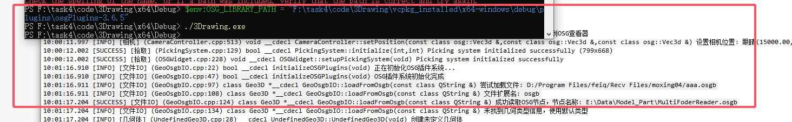

#### 常量函数

`const`函数和`mutable`：

以前一直没遇到过，难怪不理解，`const`函数是对普通函数的重载，当对象是`const`修饰的时候，会调用`const`成员函数（不能调用普通函数）。

在`const`函数里只能修改`mutable`修饰的成员变量。


#### 环境变量存储机制

- 环境变量表：操作系统维护一个环境变量表，每个进程都有自己的环境变量副本

- 键值对格式：环境变量以 KEY=VALUE 的格式存储

- 字符串数组：在 C 程序中，环境变量通过 char* environ[] 数组访问

```cpp
char* getenv(const char* name);
```

`getenv` 是 C/C++ 标准库中用于获取环境变量的函数。

也可以运行时设置：

```cpp
#include <cstdlib>

#ifdef _WIN32
    #include <cstdlib>
    bool setEnvironmentVariable(const std::string& name, const std::string& value) {
        std::string env_string = name + "=" + value;
        return _putenv(env_string.c_str()) == 0;
    }
#else
    #include <cstdlib>
    bool setEnvironmentVariable(const std::string& name, const std::string& value) {
        return setenv(name.c_str(), value.c_str(), 1) == 0;
    }
#endif
```


运行阶段，当你在命令行或 IDE 里启动程序时，操作系统会把父进程（比如 Shell、IDE 进程）的环境表拷贝一份，作为你程序的 `environ[]`。

（不是硬编码进去的，所以CMake等工程改不了）

动态链接器使用的是**内核直接给它的环境变量列表**（`envp`／PEB）（在程序可用前操作），而不是运行时库的 `getenv()`。

environ的主要作用是：

**运行时定制**
 如果某个程序或库需要运行时配置，而不想把这些配置“硬编码”在二进制里，就可以随时用环境变量来注入。比如：

- 指定日志级别：`export LOG_LEVEL=DEBUG`
- 指定数据文件路径：`export DATA_DIR=/path/to/data`
- 调整第三方库行为：`export OSG_LIBRARY_PATH=…`


他们在不同的阶段独立起作用：

**CMake 阶段**

- CMake（包括它生成的 Ninja/VS 工程）**只在构建／生成阶段**读取当前 Shell 或 IDE 的环境变量（如 `CMAKE_PREFIX_PATH`、`PATH`、你手动 `export` 的变量等），然后选择相应的头文件、库路径进行编译、链接，最终产出可执行文件或库。
- 它不会把这些环境变量“写入”到可执行文件里，更不会影响程序运行时父进程之后的环境表。

**动态链接器阶段**

- 在你执行可执行文件、内核调用 `exec` 时，内核会把父进程传下来的环境变量块（`envp[]`）和命令行参数一起交给动态链接器（loader）。
- 动态链接器**在 libc 初始化、用户代码运行前**就直接遍历这一块内存，查找特定的环境变量（如 Linux 上的 `LD_LIBRARY_PATH`、`LD_PRELOAD`，Windows 上的 `PATH` 等），并据此决定从哪些目录加载 `.so`／`.dll`。
- 它并不调用 C 运行时的 `getenv()`，而是自己的低级扫描逻辑，所以程序中的 `setenv()`、`_putenv()` 对这一步骤没有任何影响。

**进程的 `environ[]` 数组**

- 动态链接器加载完所有依赖库、C 运行时初始化完毕后，`argv[]` 和环境变量才被 libc 包装成 `main(int argc, char** argv, char** envp)` 传给程序，此时你才能通过

  ```
  cpp复制编辑extern char** environ;
  char* v = std::getenv("MY_VAR");
  ```

  看到并修改环境变量。

- 除非程序主动调用如 `setenv`／`_putenv`（或 Windows 的 `AddDllDirectory`、`SetDllDirectory`）等接口，否则这份拷贝不会被外部如 CMake、Make、MSBuild 等再改动。


所以类似osg的动态加载插件库，因为连接的时候没有依赖，`CMake／VS` 不会主动替你拷插件库。

所以如果没有定义系统环境变量`OSG_LIBRARY_PATH` 或`OSG_LD_LIBRARY_PATH`，需要手动指定在 `CMakeLists.txt` 里用 `add_custom_command(... POST_BUILD)` 或者 `install(DIRECTORY ...)`，把你的 `osgPlugins` 整个目录或者单个 DLL 拷到可执行文件旁。

或者命令行（在父进程中设置）设置`$env:OSG_LIBRARY_PATH = "F:\task4\code\3Drawing\vcpkg_installed\x64-windows\debug\plugins\osgPlugins-3.6.5"`

然后成功了




